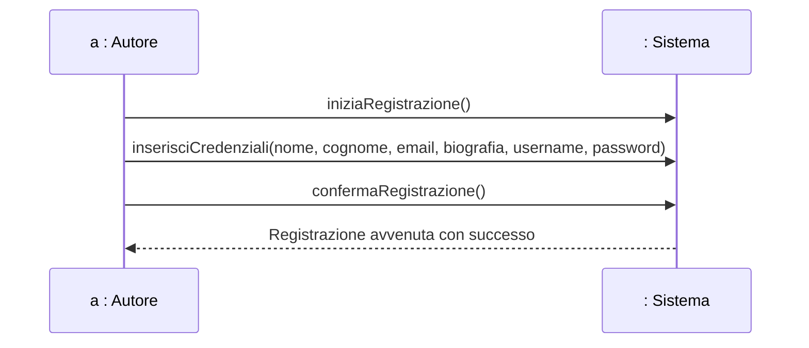
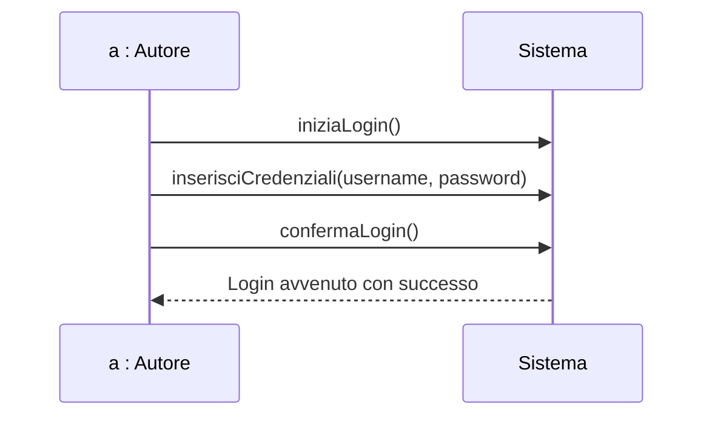
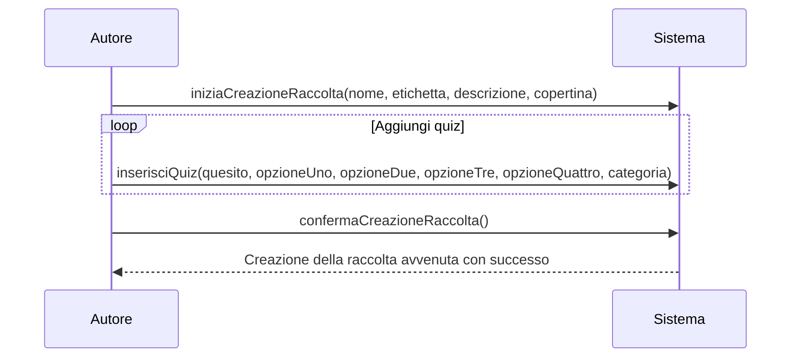
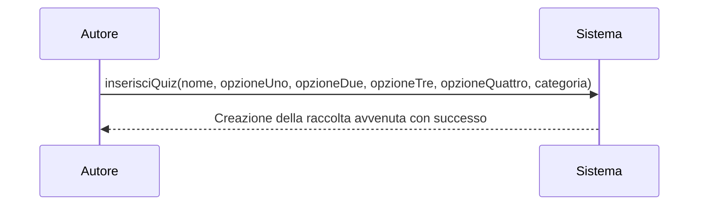
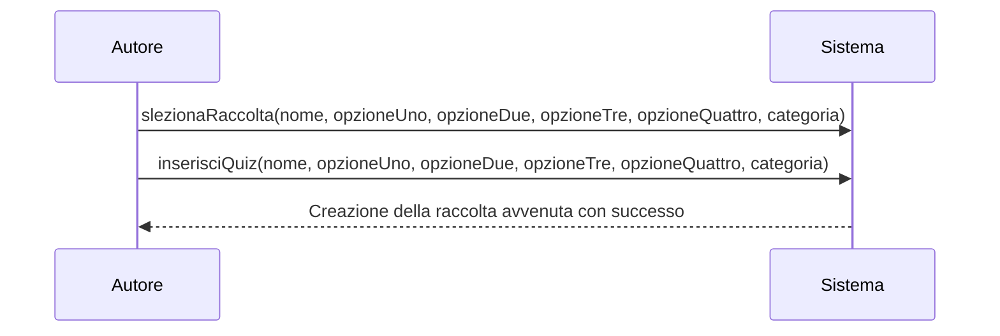
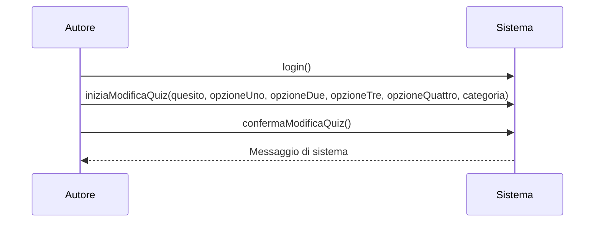
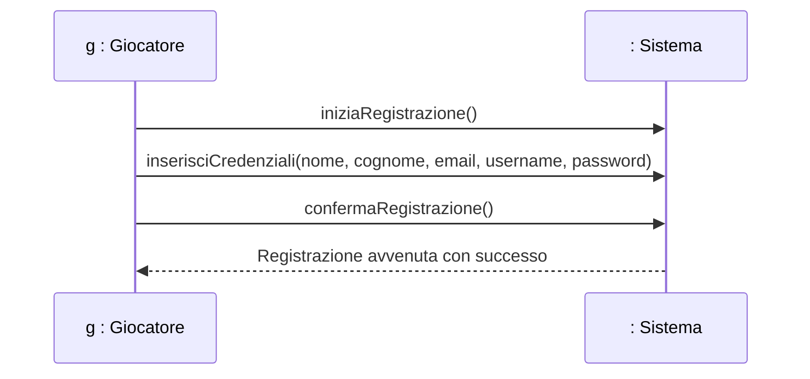
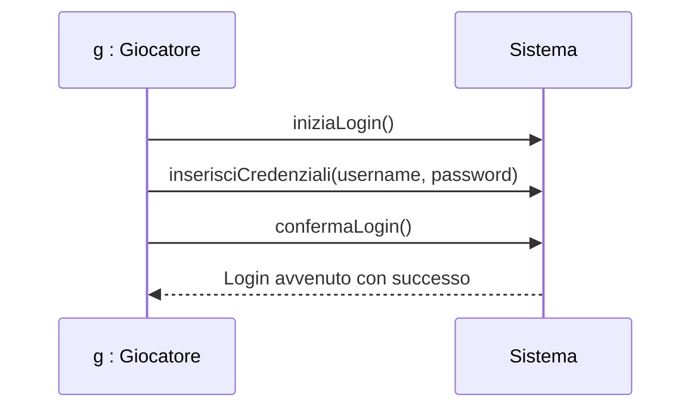
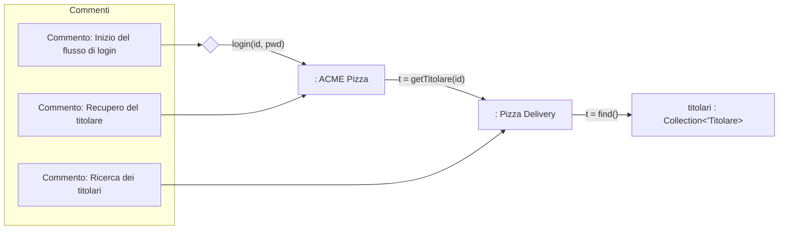
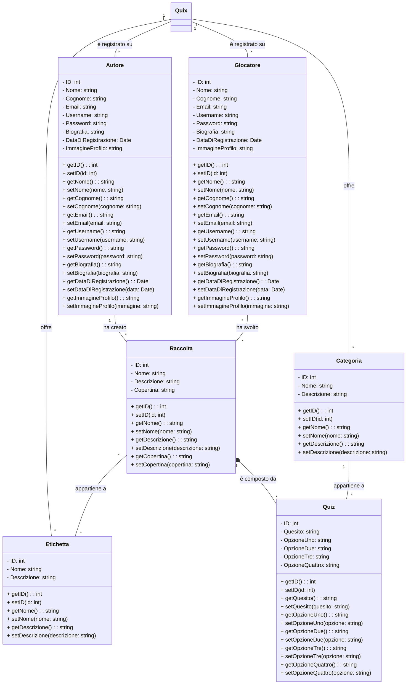

# Progetto Quix

## Indice
1. [Intro](#intro)
2. [Modello di dominio](#modello-di-dominio)
3. [Casi d'uso](#2-casi-duso)
    - [Casi d'uso dell'Autore](#casi-duso-dellautore)
        1. [Registrazione di un autore](#a-registrazione-di-un-autore)
        2. [Login di un autore](#b-login-di-un-autore)
        3. [Creazione di una raccolta](#c-creazione-di-una-raccolta)
        4. [Creazione di un quiz](#d-creazione-di-un-quiz)
        5. [Modifica di una raccolta](#e-modifica-di-una-raccolta)
        6. [Modifica di un quiz](#f-modifica-di-un-quiz)
    - [Casi d'uso del Giocatore](#casi-duso-delgiocatore)
        1. [Registrazione di un giocatore](#a-registrazione-di-un-giocatore)
        2. [Login di un giocatore](#b-login-di-un-giocatore)
4. [Contratti](#contratti)
5. [Diagramma di comunicazione](#diagramma-di-comunicazione)
6. [Diagramma delle classi](#diagramma-delle-classi)

## Intro
Quix è un sistema di quiz accessibile da internet e sviluppato usando tecnologie come:
- Java Springboot
- Thymeleaf
- Bootstrap 5

## Modello di dominio
Le classi concettuali evidenziate in questo progetto sono:
- **Quix:**
- **Autore:** classe che modella l'entità fisica della persona che si occupa di creare delleraccolte di quiz
- **Giocatore:** classe che modella l'entità fisica della persona che interagisce giocando le raccolte di quiz
- **Raccolta:** classe che modella dei contenitori che raccolgono uno o più quiz
- **Eticheta:** classe che modella le etichette assegnabili alle raccolte e che hanno il compito di catalogare per tiopologia le raccolte
- **Quiz:** classe che modella i quiz
- **Categoria:** classe che modella le categorie assegnabili ai quiz e che hanno il compito di catalogare per tiopologia i quiz

## Casi d'uso
Seguono i principali casi d'uso delle due tipologie di utene: Autore e Giocatore.
### Casi d'uso dell'Autore
#### a. Registrazione di un autore
Operazione che indica la registrazione di un utente di tipo Autore o Giocatore

#### b. Login di un autore

#### c. Creazione di una raccolta

#### d. Creazione di un quiz

#### e. Modifica di una raccolta

#### f. Modifica di un quiz

### Casi d'uso del Giocatore
#### a. Registrazione di un giocatore
Operazione che indica la registrazione di un utente di tipo Giocatore.

#### b. Login di un giocatore

## Contratti
### Registrazione
#### operazione()
**pre-condizioni:**
- ...
- ...
**post-condizioni:**
- testo 

## Diagramma di comunicazione
### b. Login di un giocatore

## Diagramma delle classi

