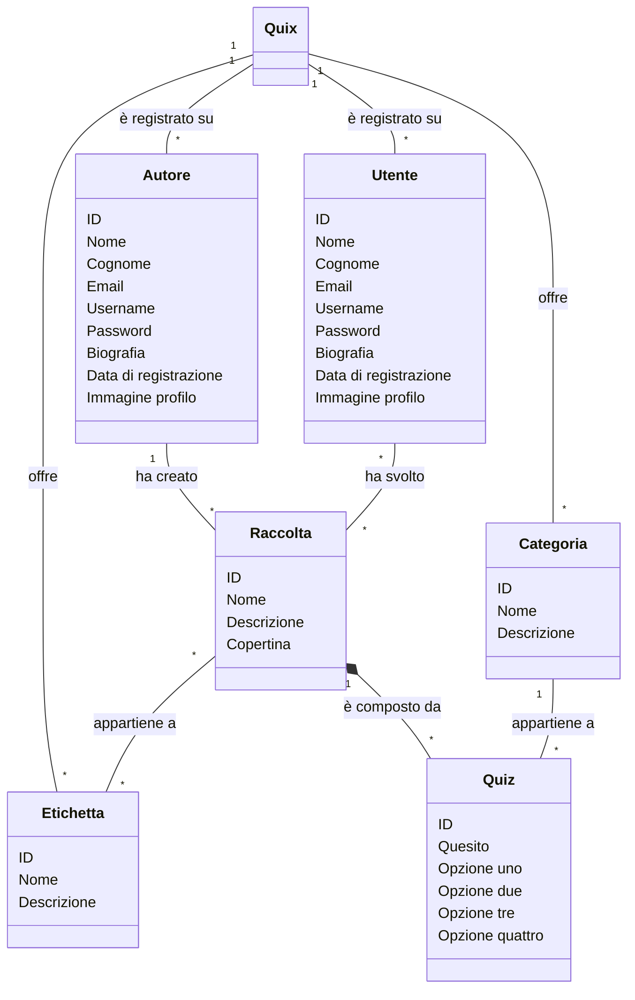
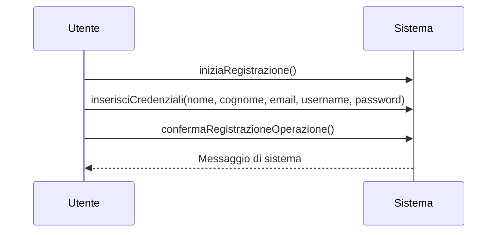
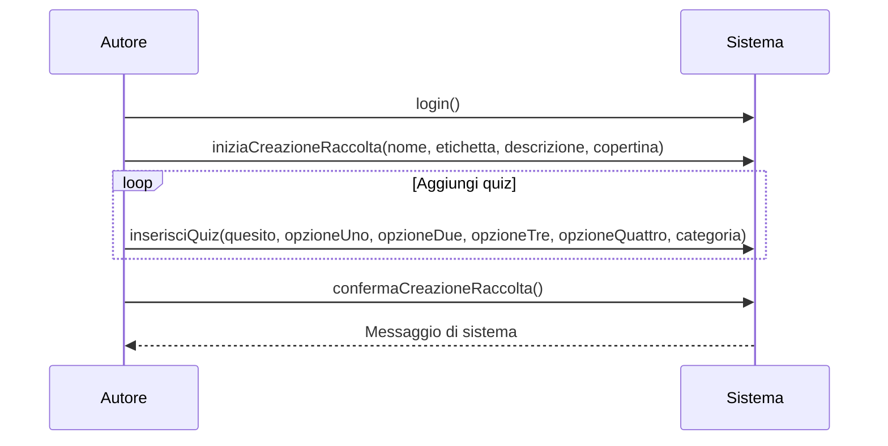
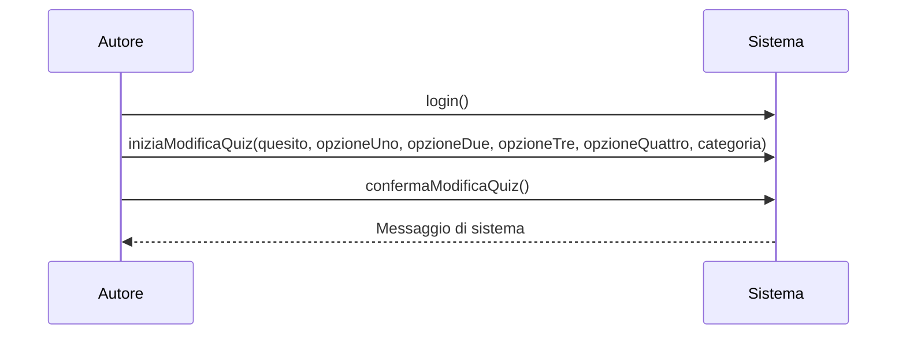

# Progetto Quix

## Indice
1. [Intro](#intro)
2. [Modello di dominio](#1-modello-di-dominio)
3. [Operazioni di sistema](#2-operazioni-di-sistema)
    1. [Registrazione](#i-operazione-registrazione)
    2. [Creazione raccolta](#ii-operazione-creazione-raccolta)
    3. [Modifica quiz](#iii-operazione-modifica-quiz)
4. [Contratti](#3-contratti)
    - [Registrazione](#i-contratto-registrazione)
    - [Creazione raccolta](#ii-contratto-creazione-raccolta)
5. [Diagramma delle classi](#iii-diagramma-delle-classi)

## Intro
Quix è un sistema di quiz accessibile da internet e sviluppato usando telcolgie come:
- Java Springboot
- Thymeleaf
- Bootstrap 5

## 1. Modello di dominio

## 2. Operazioni di sistema
### i. Operazione Registrazione

### ii. Operazione Creazione raccolta

### iii. Operazione Modifica quiz

## Contratti
### Registrazione
#### operazione()
**pre-condizioni:**
- ...
- ...
**post-condizioni:**
- testo 

## 4. Diagramma delle classi

